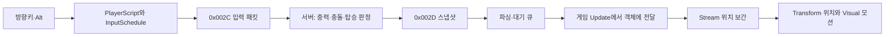

# 중력·점프·로프·사다리: 코드 학습과 맵 커스터마이징

기준: 2026-09-30, 구현 커밋 `0d2937f` + `a22c42b`. 이 문서는 현재 적용된 코드를 읽으면서 맵을 직접 수정하는 단일 학습 가이드다. **게임 코드는 변경하지 않았으며, ‘실습 예시’로 표시한 JSON은 아직 적용되지 않았다.**

먼저 1~5절로 맵을 맞추고, 6~11절로 실행 흐름을 공부하면 된다. ‘적용 코드’ 블록은 실제 소스에서 추출했으며 줄 끝 공백만 정리했다. 코드 블록은 다시 붙여 넣는 패치가 아니라 읽기 자료다.

## 목차

1. [이번 구현에서 서버와 클라이언트가 하는 일](#01)
2. [어느 파일을 수정해야 하는가](#02)
3. [배경 이미지에서 좌표 읽기](#03)
4. [발판·로프·사다리 편집 실습](#04)
5. [저장·동기화·실행 확인](#05)
6. [입력과 패킷: 키를 누르면 무엇이 일어나는가](#06)
7. [스냅샷 수신과 게임 스레드 적용](#07)
8. [위치 보간과 이동 상태](#08)
9. [플레이어·다른 플레이어·몬스터](#09)
10. [애니메이션 교체](#10)
11. [사망·부활·맵 이동](#11)
12. [디버깅과 학습 체크리스트](#12)

<a id="01"></a>
## 1. 이번 구현에서 서버와 클라이언트가 하는 일

**실제 중력과 발판 충돌은 서버가 계산한다. 클라이언트는 입력을 보내고 서버가 확정한 위치를 부드럽게 보여 준다.** 따라서 플레이어와 몬스터의 클라이언트 `Update()`에 중력을 더하는 코드는 없다.



| 변경하려는 것 | 수정하는 곳 |
|---|---|
| 발판 착지 높이, 줄 탑승 위치, 추락 복귀 | 서버 맵 `physics`를 수정하고 클라이언트에도 같은 값 반영 |
| 중력 세기, 점프 높이, 낙하·탑승 속도 | 서버 물리 설정/코드. 현재 클라이언트 JSON 설정이 아님 |
| 몬스터가 가장자리에서 멈추는지, 점프하는지 | 서버 몬스터 이동 규칙 |
| 배경·캐릭터 그림, 줄의 표시 방식 | 클라이언트 리소스와 렌더 코드 |
| 입력 키, 이동 보간 시간, 착지 모션 시간 | 클라이언트 입력·Stream·Visual |

서버 전달서 기준 상수는 중력 `1800`, 점프 초기 Y속도 `-650`, 최대 낙하속도 `1000`, 탑승속도 `180`, 재탑승 제한 `0.2초`다. 이는 전달 당시 값이며 서버 최신 소스는 이 저장소에 없다. 값을 바꿀 서버 함수명을 이 문서에서 임의로 지정하지 않는다.

<a id="02"></a>
## 2. 어느 파일을 수정해야 하는가

| 파일 | 역할 |
|---|---|
| 서버 `SERVER/src/CHANNEL/data/Maps/100000000.json` | 전달서가 지정한 실제 물리 데이터 원본. 서버 저장소의 상대 경로 |
| [클라이언트 100000000.json](../LL2_Client_Win/Data/Maps/100000000.json) | 해당 맵의 물리 표시 데이터와 포탈 리소스 |
| [100000001.json](../LL2_Client_Win/Data/Maps/100000001.json), [100000002.json](../LL2_Client_Win/Data/Maps/100000002.json) | 다른 두 맵. 맵별로 따로 편집 |
| [movement_data/maps.json](movement_data/maps.json) | 서버에서 받은 전달본과 테스트 기준. 게임 실행 중 읽는 파일이 아님 |
| [MapDataManager.cpp](../LL2_Client_Win_lib/MapDataManager.cpp) | 실행 작업 디렉터리의 `Data/Maps/` JSON 로딩 |
| [MovementMap.h](../LL2_Client_Win_Source/MovementMap.h) | 발판·줄 구조체와 데이터 유효성 검사 |
| [MapScene.cpp](../LL2_Client_Win_lib/MapScene.cpp) | 발판 디버그 선·줄 표시 |
| [Map_100000000.cpp](../LL2_Client_Win_lib/Map_100000000.cpp) | 이 맵의 배경과 카메라 설정 |

배경 원본은 [Resources_Woodland/Background/forest/forest_ground_1.png](../LL2_Client_Win/Resources_Woodland/Background/forest/forest_ground_1.png)다. 현재 `stbResourceManager.cpp`가 이 파일을 `Forest_ground_1`이라는 키로 등록하고, `Map_100000000.cpp`가 그 키를 직접 사용한다. **맵 JSON의 `background` 문자열만 수정해서 배경이 교체된다고 생각하면 안 된다.** 배경을 바꾸려면 리소스 등록과 맵의 `LoadMapResources()`도 확인한다.

### 현재 맵 데이터 — 적용 파일 전체

세 맵에 현재 같은 발판 3개와 줄 2개가 들어 있다. 아래는 맵 `100000000`의 실제 파일이다. 배경의 모든 발판·사다리를 자동 인식한 데이터가 아니다.

```json
{
  "mapId": 100000000,
  "name": "Forest Ground 1",
  "background": "Map/Forest/ground_1.png",
  "miniMap": "Map/Forest/ground_1_minimap.png",
  "portals": [
    {
      "id": "to_town_pending",
      "texture": "ForestPortal",
      "position": {
        "x": 100.0,
        "y": 60.0
      },
      "renderSize": {
        "x": 100.0,
        "y": 160.0
      },
      "halfSize": {
        "x": 60.0,
        "y": 100.0
      },
      "destinationMapId": 100000001,
      "spawnPosition": {
        "x": 100.0,
        "y": 500.0
      },
      "interactionRange": 120.0
    },
    {
      "id": "to_map_100000001",
      "texture": "ForestPortal",
      "position": {
        "x": 1400.0,
        "y": 770.0
      },
      "renderSize": {
        "x": 100.0,
        "y": 160.0
      },
      "halfSize": {
        "x": 60.0,
        "y": 100.0
      },
      "destinationMapId": 100000001,
      "spawnPosition": {
        "x": 120.0,
        "y": 730.0
      },
      "interactionRange": 120.0
    }
  ],
  "physics": {
    "minX": 0,
    "maxX": 1600,
    "killY": 1200,
    "safeFeet": {
      "x": 100,
      "y": 700
    },
    "platforms": [
      {
        "id": 1,
        "left": 0,
        "right": 1600,
        "y": 700
      },
      {
        "id": 2,
        "left": 300,
        "right": 650,
        "y": 500
      },
      {
        "id": 3,
        "left": 850,
        "right": 1200,
        "y": 350
      }
    ],
    "climbables": [
      {
        "id": 1,
        "kind": "ladder",
        "x": 450,
        "top": 500,
        "bottom": 700,
        "grabRange": 16,
        "topPlatformId": 2
      },
      {
        "id": 2,
        "kind": "rope",
        "x": 1000,
        "top": 350,
        "bottom": 700,
        "grabRange": 16,
        "topPlatformId": 3
      }
    ]
  }
}
```

<a id="03"></a>
## 3. 배경 이미지에서 좌표 읽기

### 3-1. 월드 좌표와 화면 좌표

현재 이 맵의 배경은 월드 `(0,0)`에서 이미지 너비·높이 그대로 그린다. 원본 이미지를 편집기에서 열고 읽은 픽셀 좌표를 우선 사용하면 된다. 편집기 확대율이 아니라 **원본 이미지의 픽셀 좌표**를 기록한다.

- X는 오른쪽으로 증가한다.
- Y는 아래쪽으로 증가한다. 발판을 위로 옮기려면 `y`를 줄인다.
- 발판의 풀·장식 끝이 아니라 캐릭터 발이 닿을 표면을 기준으로 삼는다.
- 한 발판의 왼쪽 끝 `left`, 오른쪽 끝 `right`, 표면 높이 `y`를 기록한다.

적용 코드 — `Map_100000000::RenderBackground()`:

```cpp
void stb::Map_100000000::RenderBackground(stbD2DRenderer& renderer)
{
    if (m_background == nullptr || m_background->GetD2DBitmap() == nullptr)
    {
        return;
    }

    math::Vector2 screenPosition = math::Vector2::Zero;

    if (render::mainCamera != nullptr)
    {
        screenPosition = render::mainCamera->CalculatePosition(math::Vector2::Zero);
    }

    renderer.DrawBitmap(
        m_background->GetD2DBitmap(),
        screenPosition.x,
        screenPosition.y,
        static_cast<float>(m_background->GetWidth()),
        static_cast<float>(m_background->GetHeight())
    );
}
```

화면 스크린샷 좌표에는 카메라 이동량이 반영되어 있다. 현재 카메라 변환은 다음과 같다.

```cpp
Vector2 CalculatePosition(Vector2 pos) { return pos - mDistance; }
```

즉 `화면 좌표 = 월드 좌표 - 카메라 mDistance`이고, 역으로 `월드 좌표 = 화면 좌표 + mDistance`다. 필요하면 디버거에서 `mainCamera->GetDistance()`를 확인한다. 창 테두리·제목 표시줄·DPI 확대가 포함된 스크린샷 픽셀은 그대로 쓰지 않는다. 처음에는 원본 이미지에서 측정하는 것이 쉽다.

### 3-2. 객체 원점과 발 위치

패킷의 `(x,y)`는 객체 원점이다. 현재 플레이어의 발 Y는 **원점 Y + 10**이다. 발판이 `y=700`이면 서 있을 때 객체 원점은 약 `y=690`이다. 서버 Y에 10을 더해서 Transform에 넣으면 두 번 보정하게 된다.

| 값 | 어떤 좌표인가 | y=700 바닥의 예 |
|---|---|---|
| `platform.y` | 발이 닿는 표면 | 700 |
| `safeFeet.y` | 추락 복귀 시 발 좌표 | 700 |
| 스냅샷 `position.y` | 객체 원점 | 690 |
| 포탈 `spawnPosition.y` | 목적지 객체 원점 | 같은 발판 위에 놓으려면 690 |

플레이어의 `+10`은 현재 충돌체의 offset Y `-20`과 반높이 `30`에 대응한다. 몬스터는 종류별 데이터로 발점을 계산한다. 플레이어 상수만 바꾸면 서버 판정이 바뀌지는 않는다.

적용 코드 — 몬스터의 디버그 발점 계산:

```cpp
float Monster::GetFootOffset() const
{
    const auto* data = M_MONSTERDATAMANAGER->FindMonsterData(m_monsterId);
    if (!data) return 0;
    return data->colliderInfo.offset.y +
        (data->colliderInfo.colliderType == stb::enums::eColliderType::Circle2D
            ? data->colliderInfo.radius : data->colliderInfo.halfSize.y);
}
```

### 3-3. 게임에서 선을 읽는 방법

Debug 실행에서 초록선은 발판, 노란 사각형은 줄의 탑승 범위, 자홍 십자는 객체 원점, 하늘색 짧은 선은 발점이다. 갈색 줄·사다리는 현재 임시 표시이며 Release에서도 그린다.

**초록선과 하늘색 발점이 만나는데 캐릭터 그림만 떠 있으면 그림의 원점·프레임 정렬부터 확인한다.** 초록선 자체가 배경 표면과 다르면 맵 좌표를 고친다. 물리 좌표와 아트 정렬 문제를 이 기준으로 구분할 수 있다.

적용 코드 — 발판·줄 표시:

```cpp
void MapScene::RenderMovementGeometry(stbD2DRenderer& renderer)
{
    const auto* map = M_MAPDATAMANAGER->FindMapData(GetMapId());
    if (!map) return;
    auto screen = [](float x, float y)
    {
        stb::math::Vector2 point{x, y};
        return stb::render::mainCamera ? stb::render::mainCamera->CalculatePosition(point) : point;
    };
    for (const auto& c : map->physics.climbables)
    {
        auto top = screen(c.x, c.top), bottom = screen(c.x, c.bottom);
        const D2D1::ColorF brown(D2D1::ColorF::SaddleBrown);
        if (c.ladder)
        {
            renderer.DrawLine(top.x - 9, top.y, bottom.x - 9, bottom.y, brown, 3);
            renderer.DrawLine(top.x + 9, top.y, bottom.x + 9, bottom.y, brown, 3);
            for (float y = top.y; y <= bottom.y; y += 16)
                renderer.DrawLine(top.x - 9, y, top.x + 9, y, brown, 2);
        }
        else renderer.DrawLine(top.x, top.y, bottom.x, bottom.y, brown, 3);
#ifdef _DEBUG
        renderer.DrawRect(top.x - c.grabRange, top.y, c.grabRange * 2, bottom.y - top.y,
            D2D1::ColorF(D2D1::ColorF::Yellow));
#endif
    }
#ifdef _DEBUG
    for (const auto& platform : map->physics.platforms)
    {
        auto left = screen(platform.left, platform.y), right = screen(platform.right, platform.y);
        renderer.DrawLine(left.x, left.y, right.x, right.y, D2D1::ColorF(D2D1::ColorF::Lime), 2);
    }
#endif
}
```

배경에 사다리가 이미 그려져 있으면 갈색 임시 사다리와 겹칠 수 있다. 좌표를 맞춘 뒤 위 함수의 갈색 그리기 부분을 제거하거나 원하는 리소스 렌더로 교체하면 된다. 이 변경은 외형에만 영향을 준다. `physics.climbables`까지 지우면 줄의 데이터도 사라지므로 함께 삭제하지 않는다.

<a id="04"></a>
## 4. 발판·로프·사다리 편집 실습

### 4-1. 필드 의미

| 위치 | 필드 | 의미 |
|---|---|---|
| `physics` | `minX`, `maxX` | 서버가 사용하는 가로 이동 경계 |
| `physics` | `killY` | 추락 복귀 판정용 아래쪽 경계 |
| `physics` | `safeFeet` | 복귀할 발 좌표. 실제 발판 위에 배치 |
| `platforms[]` | `id` | 맵 안에서 발판을 구별하는 양수 ID |
| `platforms[]` | `left`, `right`, `y` | 수평 발판의 구간과 표면 높이 |
| `climbables[]` | `id`, `kind` | 줄 ID와 `rope` 또는 `ladder` |
| `climbables[]` | `x` | 줄 중앙의 월드 X |
| `climbables[]` | `top`, `bottom` | 줄 위·아래 끝의 월드 Y |
| `climbables[]` | `grabRange` | 줄 중심 좌우 탑승 범위. 16이면 표시 폭은 32 |
| `climbables[]` | `topPlatformId` | 위 끝에 도착했을 때 올라설 발판 ID |

현재 발판은 수평 단방향 발판이다. 기울기·벽·천장 충돌을 이 JSON만으로 만들 수는 없다. 착지는 서버에서 발 X 중앙점을 기준으로 판정한다. 캐릭터 그림의 좌우 폭 전체로 착지를 판단하지 않는다.

현재 로더가 검사하는 규칙:

- `minX < maxX`, `safeFeet.x`는 가로 경계 안, `safeFeet.y < killY`.
- 발판마다 `left < right`, ID는 양수이고 발판 배열 안에서 중복 금지.
- 줄마다 `top < bottom`, `grabRange > 0`, ID는 양수이고 줄 배열 안에서 중복 금지.
- `topPlatformId`의 발판이 존재해야 한다. 줄 X가 그 발판 구간 안에 있어야 한다.
- 줄 `top`과 연결 발판 `y`의 차이는 `0.05` 이하여야 한다. 편집할 때는 같은 숫자를 쓴다.
- 이 연결 조건은 **로프와 사다리 모두** 적용된다. 현재 구조는 위쪽 출구 없는 매달린 줄을 허용하지 않는다.

발판 ID와 줄 ID는 서로 다른 목록이므로 각각 `id=1`이어도 된다. 목록의 배열 순서는 서버 전달본과 같게 유지한다. 로더가 `safeFeet` 아래 실제 발판 존재 여부까지 검사하지는 않으므로 사람이 확인해야 한다.

발판을 처음 맞출 때 다음 표를 메모하면서 작업하면 연결을 놓치지 않는다.

| 배경에서 측정할 것 | JSON에 적을 곳 |
|---|---|
| 서 있을 표면의 왼쪽·오른쪽 X | 발판 left/right |
| 표면의 원본 이미지 Y | 발판 y |
| 줄 그림의 중앙 X | 줄 x |
| 줄의 상단 발판 높이 | 줄 top, 연결 발판 y |
| 줄의 아래 끝 Y | 줄 bottom |
| 안전하게 복귀할 발판 위 점 | safeFeet |

### 4-2. 기존 발판을 이동하기

현재 발판 2는 `left=300, right=650, y=500`이며 사다리 1의 위 끝과 연결된다. 원본 이미지에서 새 표면을 `left=280, right=680, y=480`, 사다리 중심을 `x=460`으로 측정했다고 가정하자.

**실습 예시 — 실제 이미지 측정값이 아니며 아직 적용하지 않은 값:**

```json
{
  "platform": { "id": 2, "left": 280, "right": 680, "y": 480 },
  "climbable": {
    "id": 1, "kind": "ladder", "x": 460,
    "top": 480, "bottom": 700, "grabRange": 16, "topPlatformId": 2
  }
}
```

위 객체의 `platform` 값은 기존 `platforms` 배열의 2번 발판 항목에, `climbable` 값은 `climbables` 배열의 1번 줄 항목에 넣는다. `platform`·`climbable`이라는 새 키를 실제 맵 루트에 만드는 예시가 아니다.

수정 순서는 **발판 y → 연결 줄 top → 줄 x가 발판 안인지 확인 → bottom과 하단 발판 확인**이다. 사다리 모양만 옮기고 `topPlatformId`를 그대로 잘못 연결하면 올라서는 지점이 맞지 않는다.

### 4-3. 새 발판과 로프 추가하기

현재 맵에 다음 두 항목을 추가하는 연습을 할 수 있다. 발판 ID 4, 줄 ID 3은 현재 데이터에 없는 값이다.

**실습 예시 — 각각 해당 배열에 추가:**

```json
{
  "platform": { "id": 4, "left": 100, "right": 260, "y": 560 },
  "climbable": {
    "id": 3, "kind": "rope", "x": 180,
    "top": 560, "bottom": 700, "grabRange": 18, "topPlatformId": 4
  }
}
```

`kind`를 `ladder`로 바꾸면 사다리 표시·모션을 선택한다. `grabRange`만 키우면 더 넓은 범위에서 탑승할 수 있지만 실제 허용 판정도 바꾸려면 서버 값이 같아야 한다.

### 4-4. 바닥에 구멍을 만들기

현재 발판 1은 X `0~1600`을 모두 덮는다. 그 아래에 구멍 그림이 있어도 이 발판이 남아 있으면 추락하지 않는다. 예를 들어 X `700~820`을 비우려면 기존 발판 1을 `0~700`으로 줄이고, 별도 ID의 발판을 `820~1600`에 추가한다. 두 발판의 Y는 기존 바닥과 같게 둔다. 이 구간을 덮는 다른 아래쪽 발판도 함께 확인한다.

바닥 높이를 바꿀 때는 `safeFeet`, 줄의 `bottom`, 포탈 위치와 목적지 `spawnPosition`도 점검한다. `killY`는 복귀 발판보다 충분히 아래에 둔다. 배경 이미지 크기가 곧 `physics.maxX/killY`는 아니다. 카메라는 배경 크기를 쓰고 서버 물리는 별도 경계 값을 쓴다.

### 4-5. 포탈과 스폰

`position`은 포탈 위치, `interactionRange`는 상호작용 거리, `destinationMapId`는 목적지, `spawnPosition`은 목적지 캐릭터 원점이다. 실제 목적지와 스폰은 서버가 결정한다. 클라이언트에만 다른 목적지를 적어서는 바뀌지 않는다.

포탈 입력은 Space(`Interact`)이며 지상 상태에서 사용한다. 현재 코드는 원점 간 거리로 검사하므로 `halfSize`를 크게 바꾸는 것만으로 상호작용 거리가 늘지 않는다. `texture/renderSize`는 외형 설정이다.

적용 코드 — `Portal::Update()`:

```cpp
void Portal::Update()
{
    GameObject::Update();
    if (m_transitioning || m_destinationScene.empty()) return;
    auto* player = M_PLAYERMANAGER->GetLocalPlayer();
    if (!player || player->IsDead() || !player->GetMovementScript()->CanUsePortal() ||
        UIManager::getInstance()->IsInputFocused() || UIManager::getInstance()->IsGameplayInputBlocked() ||
        GetForegroundWindow() != GetAncestor(stb::Application::getInstance()->GetHWND(), GA_ROOT)) return;
    auto* tr = GetComponent<Transform>();
    auto* playerTransform = player->GetComponent<Transform>();
    if (!tr || !playerTransform || !M_INPUT->GetActionDown(eActionCode::Interact)) return;
    auto delta = playerTransform->GetPosition() - tr->GetPosition();
    if (delta.x * delta.x + delta.y * delta.y > m_interactionRange * m_interactionRange) return;
    m_transitioning = true;
    PortalPacketHandler::SendPortalEnter(m_portalId);
}
```

기존 전달본에는 y=60의 `to_town_pending`, 바닥 아래 일부 스폰 좌표가 있다. 또한 `to_map_100000003`의 실제 목적지는 `100000002`다. 이름만 보고 수정하지 말고 서버와 의도한 위치·목적지를 정한 뒤 양쪽을 맞춘다.

<a id="05"></a>
## 5. 저장·동기화·실행 확인

### 권장 작업 순서

1. 기존 맵 하나를 선택하고 배경 원본에서 좌표를 측정한다.
2. 서버 맵 원본의 `physics` 및 필요한 포탈 값을 수정한다.
3. 같은 값을 클라이언트 `LL2_Client_Win/Data/Maps/<mapId>.json`에 반영한다. 클라이언트 전용 텍스처·크기는 보존한다.
4. 서버의 최신 전달본으로 `docs/movement_data/maps.json`도 갱신한다. 이 저장소에 자동 동기화 기능은 없다.
5. 서버의 로딩 방식에 맞춰 서버를 재시작/재로딩하고 클라이언트도 완전히 종료 후 다시 실행한다. 현재 클라이언트는 초기 로딩한 맵을 캐시하며 실행 중 파일 변경을 자동 반영하지 않는다.
6. Debug 초록선·노란 영역과 배경을 비교하고, 실제 착지·탑승까지 확인한다.

`sourceSha256`은 **해당 서버 원본 파일의 해시**다. 수동으로 클라이언트 값을 바꾼 뒤 예전 해시를 최신 원본 해시라고 사용하지 않는다. 서버 원본 기준으로 다시 계산해서 전달본에 기록한다.

적용 코드 — 맵 파일 로딩 중 물리 검증:

```cpp
bool MapDataManager::LoadJsonFile(const std::string& path, MapData& mapData)
{
    std::ifstream file(path);
    if (!file.is_open()) {
        return false;
    }

    nlohmann::json j;
    try {
        file >> j;
    }
    catch (const nlohmann::json::parse_error&) {
        return false;
    }
    if (j.is_null()) return false;

    try
    {
        mapData.physics = movement::ParseMapGeometry(j.at("physics"));
    }
    catch (const std::exception& error)
    {
        OutputDebugStringA(("[Map physics] " + path + ": " + error.what() + "\n").c_str());
        return false;
    }

    mapData.mapId = j.at("mapId").get<int>();
    mapData.name = j.at("name").get<std::string>();
    mapData.background = j.at("background").get<std::string>();

    if (j.contains("portals"))
    {
        for (const auto& portalJson : j.at("portals"))
        {
            PortalData portalData;

            portalData.id = portalJson.value("id", "");
            portalData.interactionRange = portalJson.value("interactionRange", 120.0f);
            portalData.texture = portalJson.value("texture", "");
            const auto& position = portalJson.at("position");
            portalData.position.x = position.value("x", 0.0f);
            portalData.position.y = position.value("y", 0.0f);
            if (portalJson.contains("renderSize"))
            {
                const auto& renderSize =
                    portalJson.at("renderSize");

                portalData.renderSize.x =
                    renderSize.value("x", 100.0f);

                portalData.renderSize.y =
                    renderSize.value("y", 160.0f);
            }

            const auto& halfSize = portalJson.at("halfSize");
            portalData.halfSize.x = halfSize.value("x", 60.0f);
            portalData.halfSize.y = halfSize.value("y", 100.0f);
            portalData.destinationMapId = portalJson.at("destinationMapId").get<int>();
            const auto& spawnPosition = portalJson.at("spawnPosition");
            portalData.spawnPosition.x = spawnPosition.value("x", 0.0f);
            portalData.spawnPosition.y = spawnPosition.value("y", 0.0f);

            mapData.portals.emplace_back(portalData);
        }
    }
    return true;
}
```

파일 경로는 실행 작업 디렉터리 기준 `Data/Maps/`다. 수정이 안 보이면 실제 실행 폴더/Visual Studio 디버깅 작업 디렉터리를 먼저 확인한다. 기존 ID를 수정하는 JSON 변경만이면 C++ 재빌드는 필요 없지만 재실행은 필요하다. C++이나 리소스 등록 코드를 바꿨다면 재빌드한다.

구조체와 유효성 검사를 직접 공부하려면 아래 코드를 읽는다. `MapGeometry`가 JSON의 메모리 표현이고, `ParseMapGeometry()`는 잘못된 연결을 실행 전에 거부한다.

<details>
<summary>적용 코드: MovementMap.h 전체 — 맵 데이터 구조와 검사</summary>

```cpp
#pragma once
#include "MovementTypes.h"
#include <nlohmann/json.hpp>
#include <cmath>
#include <set>
#include <stdexcept>
#include <string>
#include <vector>

namespace movement
{
    struct Platform { int id = 0; float left = 0, right = 0, y = 0; };
    struct Climbable
    {
        int id = 0;
        bool ladder = false;
        float x = 0, top = 0, bottom = 0, grabRange = 0;
        int topPlatformId = 0;
    };
    struct MapGeometry
    {
        float minX = 0, maxX = 0, killY = 0;
        Point safeFeet;
        std::vector<Platform> platforms;
        std::vector<Climbable> climbables;
        const Climbable* FindClimbable(int id) const
        {
            for (const auto& c : climbables) if (c.id == id) return &c;
            return nullptr;
        }
    };
    inline MapGeometry ParseMapGeometry(const nlohmann::json& json)
    {
        MapGeometry result;
        auto number = [](const nlohmann::json& object, const char* name)
        {
            float value = object.at(name).get<float>();
            if (!std::isfinite(value)) throw std::runtime_error("non-finite map geometry");
            return value;
        };
        result.minX = number(json, "minX"); result.maxX = number(json, "maxX");
        result.killY = number(json, "killY");
        result.safeFeet = {number(json.at("safeFeet"), "x"), number(json.at("safeFeet"), "y")};
        if (result.minX >= result.maxX || result.safeFeet.x < result.minX ||
            result.safeFeet.x > result.maxX || result.safeFeet.y >= result.killY)
            throw std::runtime_error("invalid map bounds/safeFeet");
        std::set<int> ids;
        for (const auto& p : json.at("platforms"))
        {
            Platform platform{p.at("id").get<int>(), number(p, "left"), number(p, "right"), number(p, "y")};
            if (platform.id <= 0 || !ids.insert(platform.id).second || platform.left >= platform.right)
                throw std::runtime_error("invalid platform");
            result.platforms.push_back(platform);
        }
        ids.clear();
        for (const auto& c : json.at("climbables"))
        {
            const std::string kind = c.at("kind").get<std::string>();
            Climbable climbable{c.at("id").get<int>(), kind == "ladder", number(c, "x"),
                number(c, "top"), number(c, "bottom"), number(c, "grabRange"), c.at("topPlatformId").get<int>()};
            if ((kind != "rope" && kind != "ladder") || climbable.id <= 0 ||
                !ids.insert(climbable.id).second || climbable.top >= climbable.bottom || climbable.grabRange <= 0)
                throw std::runtime_error("invalid climbable");
            bool exitFound = false;
            for (const auto& p : result.platforms)
                if (p.id == climbable.topPlatformId && climbable.x >= p.left && climbable.x <= p.right &&
                    std::abs(climbable.top - p.y) <= 0.05f) exitFound = true;
            if (!exitFound) throw std::runtime_error("climbable top platform missing");
            result.climbables.push_back(climbable); // Preserve server array order.
        }
        return result;
    }
}
```

</details>

### 발판 개수를 바꿨을 때 테스트 수정

현재 `MovementTests.cpp`의 `MapData()`는 전달 당시 구성을 고정 검증한다. 다음 줄은 **현재 적용 코드**다.

```cpp
Require(geometry.platforms.size() == 3 && geometry.climbables.size() == 2, "server geometry incomplete");
```

발판을 추가하면 이 검사는 의도대로 실패한다. 새 설계의 기대 개수로 수정하거나 맵별 기대값 표를 사용한다. 바로 아래의 `FindClimbable(1/2)` 종류 검사와 끝의 잘못된 줄 데이터 검사도 기존 ID·배열 위치를 전제로 하므로 줄을 삭제/재정렬했다면 같이 수정한다. 단순히 실패하는 검사를 모두 지우지 않는다.

이 일치 검사는 계속 유지한다. 클라이언트 파일과 최신 서버 전달본이 달라지는 실수를 잡아 준다.

```cpp
Require(client.at("physics") == map.at("physics"), "client/server physics export mismatch");
```

클라이언트 데이터와 전달본이 같다는 사실은 실제 실행 중인 서버까지 같다는 보장은 아니다. 서버 배포/재시작도 확인한다. 테스트는 저장소 루트에서 실행한다.

```powershell
& 'C:/Program Files/Microsoft Visual Studio/2022/Community/MSBuild/Current/Bin/MSBuild.exe' LL2_Client_Win.sln /m /p:Configuration=Debug /p:Platform=x64 /v:minimal
& .\x64\Debug\LL2_Client_PacketTests.exe
```

새 맵 ID를 만드는 작업은 별도다. JSON만 추가하지 말고 `Map_<id>` 씬 클래스와 씬 등록, 배경 리소스, 서버 맵/포탈 등록까지 확인해야 한다. 이 절은 이미 등록된 세 맵의 편집을 기준으로 한다.

<a id="06"></a>
## 6. 입력과 패킷: 키를 누르면 무엇이 일어나는가

### 데이터 구조부터 읽기

적용 코드 — [MovementTypes.h](../LL2_Client_Win_Source/MovementTypes.h):

```cpp
#pragma once
#include <cstdint>

namespace movement
{
    enum class Kind : int { Player = 0, Monster = 1 };
    enum class Mode : int { Grounded = 0, Rising = 1, Falling = 2, Climbing = 3 };
    enum class PlayerLife : int { Idle = 0, Move = 1, Jump = 2, Attack = 3, Stunned = 4, Dead = 5 };
    enum class MonsterLife : int
    {
        Idle = 0, Patrol = 1, Chase = 2, Move = 3, Dying = 4,
        Hit = 5, RangeAttack = 6, Dead = 7, None = 8
    };

    struct Point { float x = 0; float y = 0; };
    struct Input { int horizontal = 0; int vertical = 0; bool jump = false; };
    struct Snapshot
    {
        int mapId = 0;
        Kind kind = Kind::Player;
        int entityId = 0;
        int epoch = 0;
        std::uint64_t tick = 0;
        int sequence = 0; // Last accepted input, NOT a physics acknowledgement.
        Point position;
        Point velocity;
        Mode mode = Mode::Grounded;
        int facing = -1;
        int climbableId = 0;
        int lifeState = 0;
        int hp = 0;
        int maxHp = 0;
    };
    inline bool IsDead(const Snapshot& s)
    {
        return s.kind == Kind::Player ? s.lifeState == static_cast<int>(PlayerLife::Dead)
            : s.lifeState == static_cast<int>(MonsterLife::Dying) ||
              s.lifeState == static_cast<int>(MonsterLife::Dead);
    }
    inline bool IsStunned(const Snapshot& s)
    {
        return s.kind == Kind::Player && s.lifeState == static_cast<int>(PlayerLife::Stunned);
    }
    inline bool IsNewer(const Snapshot& a, const Snapshot& b)
    {
        return a.epoch > b.epoch || (a.epoch == b.epoch && a.tick > b.tick);
    }
    inline constexpr float PlayerFootOffset = 10.0f;
}
```

`mode`는 중력 이동 상태, `lifeState`는 전투·생명 상태다. 점프 중 공격처럼 두 상태가 함께 필요하다. 플레이어와 몬스터의 `lifeState` 숫자는 다르므로 기존 `PlayerState`로 그대로 캐스팅하면 안 된다.

`epoch`는 같은 객체의 이동 기록 세대를 구분한다. 복귀·부활·맵 전환 등으로 새 세대가 되면 이전 보간을 버린다. `tick`은 같은 세대 안의 순서이고, `sequence`는 마지막 수락 입력 번호다. 물리 처리 완료를 뜻하는 ack가 아니므로 입력 재실행에 사용하지 않는다.

### 매 프레임의 실제 입력 코드

적용 코드 — `PlayerScript::Update()`:

```cpp
	void PlayerScript::Update()
    {
        if (!m_player || !m_animator) return;
        const float dt = M_TIME->GetDeltaTime();
        auto* network = stb::NetworkManager::getInstance();
        if (!network || !network->IsConnected())
        {
            ResetMovementConnection();
            return;
        }
        movement::Snapshot displayed;
        if (m_movement.Update(dt, displayed))
        {
            if (auto* tr = m_player->GetComponent<Transform>())
                tr->SetPosition({displayed.position.x, displayed.position.y});
            m_player->GetPlayerLocation()->pos = {displayed.position.x, displayed.position.y};
            m_player->SetFacing(displayed.facing > 0 ? FacingDirection::Right : FacingDirection::Left);
            SyncFollowers({displayed.position.x, displayed.position.y});
            const auto* map = MapDataManager::getInstance()->FindMapData(displayed.mapId);
            const auto* climb = map ? map->physics.FindClimbable(displayed.climbableId) : nullptr;
            const bool attacking = m_player->GetState() >= PlayerState::Attack &&
                                   m_player->GetState() < PlayerState::Skill_End;
            m_movementVisual.Update(m_animator, displayed, dt, climb && climb->ladder,
                attacking && displayed.mode != movement::Mode::Climbing && !movement::IsStunned(displayed));
        }
        const HWND window = stb::Application::getInstance()->GetHWND();
        const auto held = [](eActionCode action)
        {
            return M_INPUT->GetAction(action) || M_INPUT->GetActionDown(action);
        };
        bool blocked = GetForegroundWindow() != GetAncestor(window, GA_ROOT) ||
            M_UIMANAGER->IsInputFocused() || M_UIMANAGER->IsGameplayInputBlocked() || !CanMove();
        if (blocked) { m_jumpPending = false; m_jumpNeedsRelease = true; }
        else
        {
            if (!held(eActionCode::Jump)) m_jumpNeedsRelease = false;
            if (CanAttack()) HandleCombatInput();
            HandleInput();
            blocked = M_UIMANAGER->IsInputFocused() || M_UIMANAGER->IsGameplayInputBlocked();
            if (!m_jumpNeedsRelease && M_INPUT->GetActionDown(eActionCode::Jump)) m_jumpPending = true;
        }
        if (blocked) { m_jumpPending = false; m_jumpNeedsRelease = true; }
        movement::Input input;
        if (!blocked)
        {
            input.horizontal = int(held(eActionCode::MoveRight)) - int(held(eActionCode::MoveLeft));
            input.vertical = int(held(eActionCode::MoveDown)) - int(held(eActionCode::MoveUp));
            input.jump = m_jumpPending;
        }
        int sequence = 0;
        if (CanMove() && m_inputSchedule.Poll(input, dt, blocked != m_inputBlocked, sequence))
        {
            const auto& latest = m_movement.Latest();
            MovementPacketHandler::SendInput(latest.mapId, latest.epoch, sequence, input);
        }
        m_inputBlocked = blocked;
        m_jumpPending = false;
    }
```

위 함수는 앞부분에서 서버 위치·모션을 표시하고 뒤에서 입력을 만든다. 그래서 채팅 중에도 낙하 위치는 계속 갱신된다.

읽을 지점:

- `held()`는 Down과 유지 입력을 함께 처리한다. 첫 프레임을 놓치지 않는다.
- 좌우는 `오른쪽 - 왼쪽`, 상하는 `아래 - 위`로 -1/0/1을 만든다.
- UI·포커스·사망 등의 차단 상태면 축을 0으로 만든다.
- `m_jumpPending`은 그 프레임의 점프 요청이고, `m_jumpNeedsRelease`는 복귀 후 누르고 있던 Alt가 자동 점프로 이어지는 것을 막는다.
- 첫 내 스냅샷 전에는 `CanMove()`가 false다. 서버가 먼저 스냅샷을 보내야 한다.

적용 코드 — 이동 허용 조건:

```cpp
    bool PlayerScript::CanMove() const
    {
        return m_movement.Ready() && !movement::IsDead(m_movement.Latest()) &&
            !movement::IsStunned(m_movement.Latest()) && m_player && !m_player->IsDead();
    }
```

현재 기본 키는 방향키·왼쪽 Alt 점프·Space 포탈이다. 키를 바꾸려면 `stbInput`과 액션 매핑에서 `MoveLeft/MoveRight/MoveUp/MoveDown/Jump/Interact`를 추적한다.

### 전송할 내용

| 패킷 | 필드 순서 |
|---|---|
| `0x002C` 입력 | mapId, epoch, sequence, horizontal, vertical, jump |
| `0x002D` 스냅샷 | mapId, kind, entityId, epoch, tick, sequence, x, y, vx, vy, mode, facing, climbableId, lifeState, hp, maxHp |

숫자도 길이 접두사 문자열 필드로 전달한다. 입력은 정확히 6개, 스냅샷은 정확히 16개다. `kind=0` 플레이어, `kind=1` 몬스터이며 몬스터 ID는 종류 ID가 아니라 **생성 개체 instanceId**다.

적용 코드 — 입력 필드 생성:

```cpp
bool movement::BuildInputFields(int mapId, int epoch, int sequence, const Input& input,
                                std::vector<std::string>& fields)
{
    if (mapId <= 0 || epoch < 0 || sequence <= 0 || input.horizontal < -1 ||
        input.horizontal > 1 || input.vertical < -1 || input.vertical > 1) return false;
    fields = {std::to_string(mapId), std::to_string(epoch), std::to_string(sequence),
              std::to_string(input.horizontal), std::to_string(input.vertical), input.jump ? "1" : "0"};
    return true;
}
```

클라이언트가 `(x,y)`를 보내는 코드가 없다는 점을 확인하자. 기존 `MovePacketHandler.cpp/.h`의 좌표 이동 경로는 사용하지 않는다.

<a id="07"></a>
## 7. 스냅샷 수신과 게임 스레드 적용

네트워크 콜백은 메시지를 파싱한 뒤 큐에 넣고, 게임 프레임의 `Pump()`가 객체에 적용한다. 생성 전 도착한 객체의 스냅샷도 최신 하나를 잠깐 보관한다. 전체 최대 1024개, 최대 5초다.

적용 코드 — 스냅샷 파싱. 결과는 모든 검증을 통과한 뒤에만 대입한다:

```cpp
bool movement::ParseSnapshot(const std::string& payload, Snapshot& result, std::string& error)
{
    try
    {
        Reader r(payload);
        Snapshot s;
        s.mapId = r.Number<int>();
        const int kind = r.Number<int>();
        s.entityId = r.Number<int>();
        s.epoch = r.Number<int>();
        s.tick = r.Number<std::uint64_t>();
        s.sequence = r.Number<int>();
        s.position = {r.Float(), r.Float()};
        s.velocity = {r.Float(), r.Float()};
        const int mode = r.Number<int>();
        s.facing = r.Number<int>();
        s.climbableId = r.Number<int>();
        s.lifeState = r.Number<int>();
        s.hp = r.Number<int>();
        s.maxHp = r.Number<int>();
        if (!r.Finished() || s.mapId <= 0 || kind < 0 || kind > 1 || s.entityId <= 0 ||
            s.epoch < 0 || s.sequence < 0 || mode < 0 || mode > 3 ||
            (s.facing != -1 && s.facing != 1) || s.climbableId < 0 ||
            s.lifeState < 0 || s.lifeState > (kind == 0 ? 5 : 8) ||
            s.hp < 0 || s.maxHp < 0 || s.hp > s.maxHp ||
            (kind == 1 && s.sequence != 0) || (mode == 3 && s.climbableId == 0) ||
            (mode != 3 && s.climbableId != 0))
            throw std::runtime_error("invalid movement snapshot fields");
        s.kind = static_cast<Kind>(kind);
        s.mode = static_cast<Mode>(mode);
        result = s; // All-or-nothing application.
        error.clear();
        return true;
    }
    catch (const std::exception& e)
    {
        error = e.what();
        return false;
    }
}
```

내부 `Reader`는 길이 접두사 필드를 읽고 `from_chars`로 숫자 전체를 변환한다. 비정상 숫자, 범위 초과, NaN/무한대, 잘린 필드와 남는 필드를 거부한다. 실패 시 Transform을 일부만 갱신하지 않는다.

적용 코드 — 수신 진입점:

```cpp
void MovementPacketHandler::Execute(const ParsedPacket& packet)
{
    movement::Snapshot snapshot;
    std::string error;
    if (!movement::ParseSnapshot(packet.payload, snapshot, error))
    {
        OutputDebugStringA(("[Movement rejected] " + error + "\n").c_str());
        return;
    }
    Queue({snapshot, Clock::now()});
}
```

적용 코드 — 객체별 전달:

```cpp
void MovementPacketHandler::Pump()
{
    std::map<Key, Pending> batch;
    bool reset = false;
    int mapId = 0;
    {
        std::lock_guard<std::mutex> lock(inboxMutex);
        reset = resetConnection; resetConnection = false; mapId = activeMap;
        if (!transitioning) batch.swap(inbox);
    }
    auto* player = PlayerManager::getInstance()->GetLocalPlayer();
    if (reset && player) player->GetMovementScript()->ResetMovementConnection();
    if (reset)
    {
        for (auto& entry : stb::OtherPlayerManager::getInstance()->GetPlayers())
            if (entry.second) entry.second->ResetMovementConnection();
        MonsterManager::getInstance()->ResetMovementConnections();
    }
    for (const auto& entry : batch)
    {
        const auto& pending = entry.second;
        const auto& s = pending.value;
        if (Clock::now() - pending.received > std::chrono::seconds(5)) continue;
        if (mapId != 0 && s.mapId != mapId) continue;
        if (!player || player->GetPlayerIdentity()->charId == 0 || mapId == 0)
        {
            Queue(pending); continue;
        }
        bool found = false;
        if (s.kind == movement::Kind::Player)
        {
            if (s.entityId == player->GetPlayerIdentity()->charId)
            {
                player->GetMovementScript()->ApplyMovementSnapshot(s); found = true;
            }
            else
            {
                auto& players = stb::OtherPlayerManager::getInstance()->GetPlayers();
                auto it = players.find(std::to_string(s.entityId));
                if (it != players.end() && it->second)
                {
                    it->second->ApplyMovementSnapshot(s); found = true;
                }
            }
        }
        else if (auto* monster = MonsterManager::getInstance()->FindMonster(s.entityId))
        {
            monster->ApplyMovementSnapshot(s); found = true;
        }
        if (!found) Queue(pending);
    }
}
```

여기서 `charId`가 내 캐릭터와 같으면 PlayerScript, 다르면 OtherPlayer, 몬스터이면 Monster로 보낸다. 활성 맵과 캐릭터 생성 준비가 안 됐을 때는 대기한다. 맵 ID가 맞지 않는 패킷을 새 맵에 적용하지 않는다.

적용 코드 — 프레임에서 호출되는 순서:

```cpp
	void Application::Update()
	{
		M_INPUT->Update();
		M_TIME->Update();
		MovementPacketHandler::Pump();
		M_COLMANAGER->Update();
		M_SCENEMANAGER->Update();
	}
```

읽을 때는 `Execute → Pump → ApplyMovementSnapshot → 객체 Update` 순서로 함수에 중단점을 걸면 된다.

<a id="08"></a>
## 8. 위치 보간과 이동 상태

적용 코드 — [MovementStream.h](../LL2_Client_Win_Source/MovementStream.h) 전체:

```cpp
#pragma once
#include "MovementTypes.h"
#include <algorithm>
#include <limits>

namespace movement
{
    // Server-authoritative rendering. No prediction, replay, or extrapolation.
    class Stream
    {
    public:
        bool Push(const Snapshot& value)
        {
            if (hasSnapshot && (!IsNewer(value, latest) ||
                (waitNewEpoch && value.epoch <= latest.epoch && !(allowDead && IsDead(value))) ||
                (IsDead(latest) && !IsDead(value) && value.epoch <= latest.epoch))) return false;
            const bool snap = !hasSnapshot || value.epoch != latest.epoch || IsDead(value) != IsDead(latest);
            const Snapshot previous = latest;
            latest = value;
            hasSnapshot = true;
            waitNewEpoch = false;
            elapsed = 0;
            if (snap) displayed = value;
            source = displayed;
            if (!snap)
            {
                // Advance discrete states even when packets arrive just before the blend finishes.
                source.mode = previous.mode;
                source.climbableId = previous.climbableId;
                source.velocity = previous.velocity;
            }
            return true;
        }
        bool Update(float dt, Snapshot& out)
        {
            if (!Ready()) return false;
            elapsed = (std::min)(elapsed + (std::max)(dt, 0.0f), 0.05f);
            const float alpha = elapsed / 0.05f;
            displayed = latest;
            displayed.position = {
                static_cast<float>(double(source.position.x) + (double(latest.position.x) - source.position.x) * alpha),
                static_cast<float>(double(source.position.y) + (double(latest.position.y) - source.position.y) * alpha)};
            if (alpha < 1.0f && !IsDead(latest))
            {
                displayed.mode = source.mode;
                displayed.climbableId = source.climbableId;
                displayed.velocity = source.velocity;
            }
            out = displayed;
            return true;
        }
        void Suspend(bool acceptDeath = false)
        {
            waitNewEpoch = true; allowDead = acceptDeath; displayed = source = latest; elapsed = 0;
        }
        void CancelSuspend() { waitNewEpoch = false; displayed = source = latest; elapsed = 0; }
        void Reset() { *this = Stream{}; }
        bool Ready() const { return hasSnapshot && !waitNewEpoch; }
        bool HasSnapshot() const { return hasSnapshot; }
        const Snapshot& Latest() const { return latest; }
        const Snapshot& Displayed() const { return displayed; }
    private:
        Snapshot latest, source, displayed;
        float elapsed = 0;
        bool hasSnapshot = false;
        bool waitNewEpoch = false;
        bool allowDead = false;
    };

    class InputSchedule
    {
    public:
        void Reset(int acceptedSequence = 0)
        {
            previous = {}; timer = 0; sent = false; sequence = acceptedSequence;
        }
        bool Poll(const Input& input, float dt, bool force, int& nextSequence)
        {
            timer += (std::max)(dt, 0.0f);
            const bool changed = input.horizontal != previous.horizontal || input.vertical != previous.vertical;
            if (sequence == (std::numeric_limits<int>::max)() ||
                (!force && sent && !changed && !input.jump && timer < 0.1f)) return false;
            previous = input; previous.jump = false;
            timer = 0; sent = true;
            nextSequence = ++sequence;
            return true;
        }
    private:
        Input previous;
        float timer = 0;
        int sequence = 0;
        bool sent = false;
    };
}
```

### Stream 읽기

- `latest`: 가장 최근에 수락한 서버 값.
- `displayed`: 지금 화면에 보여 주는 값.
- `source`: 새 보간을 시작하는 화면 위치.
- `Push()`: 오래된 epoch/tick을 거부하고 새 목적지를 받는다.
- `Update()`: 0.05초 동안 source에서 latest까지 이동한다. 패킷이 끊기면 마지막 위치에서 멈춘다.
- `Suspend()`: 새 epoch를 기다린다. `Reset()`은 연결 기록을 완전히 비운다.

예를 들어 X=100에서 X=110을 수신하면 보간 중간에는 X≈105를 보여 준다. 다음 서버 위치를 예측해서 X=120까지 보내지는 않는다. 첫 수신·새 epoch·생사 변화에는 위치를 즉시 반영한다.

`0.05f`를 바꾸면 **표시 지연/부드러움**이 달라지고 실제 이동속도는 바뀌지 않는다. 현재는 누적 시간 상한과 alpha 계산 두 곳에 있으므로 변경할 때 둘 다 같은 값이어야 한다.

### InputSchedule 읽기

축 변경·점프·강제 전송이면 즉시 송신하고, 같은 입력은 0.1초마다 다시 보낸다. 이 반복 송신이 heartbeat다. 서버가 마지막 축 입력을 유지하므로 멈출 때도 0 입력을 보내야 한다. `previous.jump=false`를 확인하자. 점프 요청을 계속 반복하지 않도록 만든 부분이다.

서버 전달서의 입력 만료 시간은 300ms다. heartbeat를 임의로 그보다 길게 바꾸면 입력이 만료되어 이동이 끊길 수 있다. 여기에도 중력 적분이나 발판 충돌 계산은 없다.

<a id="09"></a>
## 9. 플레이어·다른 플레이어·몬스터

적용 코드 — 내 플레이어 스냅샷 적용:

```cpp
    void PlayerScript::ApplyMovementSnapshot(const movement::Snapshot& s)
    {
        if (!m_player || s.mapId != m_player->GetPlayerLocation()->mapId) return;
        const bool newEpoch = !m_movement.HasSnapshot() || s.epoch != m_movement.Latest().epoch;
        const bool wasDead = m_player->IsDead();
        const int oldLife = m_movement.HasSnapshot() ? m_movement.Latest().lifeState : -1;
        if (!m_movement.Push(s)) return;
        if (newEpoch)
        {
            m_inputSchedule.Reset(s.sequence); m_movementVisual.Reset();
            m_jumpPending = false; m_jumpNeedsRelease = true; m_inputBlocked = true;
            m_player->SetState(movement::IsDead(s) ? PlayerState::Dead : PlayerState::Idle);
        }
        m_player->GetStat()->SetHealth(s.hp, s.maxHp);
        if (!movement::IsDead(s) && (s.mode == movement::Mode::Climbing || movement::IsStunned(s)))
            m_player->SetState(PlayerState::Idle);
        if (movement::IsDead(s))
        {
            m_jumpPending = false; m_jumpNeedsRelease = true;
            m_player->SetState(PlayerState::Dead);
            if (!wasDead) ::PostMessageW(stb::Application::getInstance()->GetHWND(), WM_SHOW_REVIVE, 0, 0);
        }
        else if (wasDead && newEpoch)
        {
            m_player->SetState(PlayerState::Idle);
            ::PostMessageW(stb::Application::getInstance()->GetHWND(), WM_REVIVE_SUCCESS, 0, 0);
        }
        else if (s.lifeState == static_cast<int>(movement::PlayerLife::Attack) && oldLife != s.lifeState &&
                 !(m_player->GetState() >= PlayerState::Attack && m_player->GetState() < PlayerState::Skill_End))
            m_player->SetState(PlayerState::Attack);
        if (newEpoch || movement::IsDead(s))
        {
            if (auto* tr = m_player->GetComponent<Transform>()) tr->SetPosition({s.position.x, s.position.y});
            m_player->GetPlayerLocation()->pos = {s.position.x, s.position.y};
            SyncFollowers({s.position.x, s.position.y});
        }
#ifdef _DEBUG
        OutputDebugStringA(("[Movement self] map=" + std::to_string(s.mapId) + " epoch=" + std::to_string(s.epoch) +
            " sequence=" + std::to_string(s.sequence) + " tick=" + std::to_string(s.tick) + "\n").c_str());
#endif
    }
```

핵심은 맵 확인 → 새 epoch 판별 → Stream에 수락 요청 → 체력/생명 상태 → 필요한 즉시 위치 갱신이다. 평상시 위치는 다음 `Update()`에서 보간한다. 새 epoch에는 입력 번호와 이전 모션도 초기화한다.

적용 코드 — 다른 플레이어:

```cpp
    void OtherPlayer::ApplyMovementSnapshot(const movement::Snapshot& s)
    {
        const bool reset = !m_movement.HasSnapshot() || s.epoch != m_movement.Latest().epoch;
        const int previousLife = m_movement.HasSnapshot() ? m_movement.Latest().lifeState : -1;
        if (!m_movement.Push(s)) return;
        if (reset)
        {
            m_movementVisual.Reset();
            m_transform->SetPosition({s.position.x, s.position.y});
            SyncFollowers({s.position.x, s.position.y});
            SetState(movement::IsDead(s) ? PlayerState::Dead : PlayerState::Idle);
        }
        if (movement::IsDead(s)) SetState(PlayerState::Dead);
        else if (s.mode == movement::Mode::Climbing || movement::IsStunned(s)) SetState(PlayerState::Idle);
        else if (s.lifeState == static_cast<int>(movement::PlayerLife::Attack) && previousLife != s.lifeState)
            SetState(PlayerState::Attack);
        mHasTarget = false;
    }
```

OtherPlayer는 로컬 키를 읽거나 입력 패킷을 보내지 않는다. 원격 스냅샷으로 위치·체력·모션을 표시한다. 이전 좌표 패킷이 스냅샷 위치를 덮지 않도록 기존 경로를 막았다.

적용 코드 — 몬스터 프레임 처리와 스냅샷 적용:

```cpp
void Monster::Update(float deltaTime)
{
    GameObject::Update();
    movement::Snapshot displayed;
    if (!m_movement.Update(deltaTime, displayed)) return;
    m_pos = {displayed.position.x, displayed.position.y};
    m_transform->SetPosition(m_pos);
    m_dir = displayed.facing;
    const auto* map = MapDataManager::getInstance()->FindMapData(displayed.mapId);
    const auto* climb = map ? map->physics.FindClimbable(displayed.climbableId) : nullptr;
    m_movementVisual.Update(m_animator, displayed, deltaTime, climb && climb->ladder,
        m_state == MonsterState::E_Hit || m_state == MonsterState::E_Die);
}
```

```cpp
void Monster::ApplyMovementSnapshot(const movement::Snapshot& s)
{
    const bool reset = !m_movement.HasSnapshot() || s.epoch != m_movement.Latest().epoch;
    const int oldLife = m_movement.HasSnapshot() ? m_movement.Latest().lifeState : -1;
    if (!m_movement.Push(s)) return;
    m_curHp = s.hp; m_maxHp = s.maxHp;
    if (reset)
    {
        m_movementVisual.Reset();
        m_pos = m_targetPos = {s.position.x, s.position.y};
        m_transform->SetPosition(m_pos);
        m_isDead = false; m_isDeathAnimationFinished = false;
        m_state = MonsterState::E_NONE;
    }
    if (s.lifeState == static_cast<int>(movement::MonsterLife::Dead))
    {
        SetState(MonsterState::E_Die);
        m_isDead = true; m_isDeathAnimationFinished = true;
    }
    else if (movement::IsDead(s)) SetState(MonsterState::E_Die);
    else if (reset || oldLife != s.lifeState)
    {
        switch (static_cast<movement::MonsterLife>(s.lifeState))
        {
        case movement::MonsterLife::Hit: SetState(MonsterState::E_Hit); break;
        case movement::MonsterLife::Patrol: SetState(MonsterState::E_Patrol); break;
        case movement::MonsterLife::Chase: SetState(MonsterState::E_Chase); break;
        case movement::MonsterLife::Move: SetState(MonsterState::E_Move); break;
        default: SetState(MonsterState::E_Idle); break;
        }
    }
}
```

몬스터도 같은 Stream과 Visual을 사용한다. 클라이언트에서 가장자리 회피·점프 AI를 추가하는 구조가 아니다. `MonsterLife::Dying/Dead` 구분과 피격·사망 모션 유지 코드를 함께 읽는다. 현재 switch에서 별도 처리하지 않는 lifeState는 Idle로 간다. 이 작업이 모든 몬스터 전투 모션까지 확장한 것은 아니다.

<a id="10"></a>
## 10. 애니메이션 교체

적용 코드 — [MovementVisual.h](../LL2_Client_Win_Source/MovementVisual.h):

```cpp
#pragma once
#include "MovementTypes.h"
#include "stbAnimator.h"
#include <algorithm>
#include <cmath>

namespace movement
{
    class Visual
    {
    public:
        void Reset() { previousMode = Mode::Grounded; landingTime = 0; }
        void Update(stb::Animator* animator, const Snapshot& s, float dt, bool ladder, bool action)
        {
            if (!animator) return;
            if ((previousMode == Mode::Rising || previousMode == Mode::Falling) && s.mode == Mode::Grounded)
                landingTime = 0.1f;
            previousMode = s.mode;
            if (s.mode != Mode::Grounded) landingTime = 0;
            const bool monster = s.kind == Kind::Monster;
            animator->SetFlipX(s.facing > 0);
            if (action && !IsDead(s))
            {
                animator->SetPaused(false); landingTime = 0; return;
            }
            std::wstring name;
            bool loop = true;
            if (IsDead(s)) { name = monster ? L"die" : L"dead"; loop = false; }
            else if (IsStunned(s)) { name = L"hit"; loop = false; }
            else if (s.mode == Mode::Rising) name = L"jump";
            else if (s.mode == Mode::Falling) name = L"fall";
            else if (s.mode == Mode::Climbing) name = ladder ? L"ladder" : L"rope";
            else if (landingTime > 0) { name = L"land"; loop = false; }
            else if (std::abs(s.velocity.x) > 0.01f) name = monster ? L"move" : L"walk";
            else name = monster ? L"idle" : L"stand";
            landingTime = (std::max)(0.0f, landingTime - dt);
            if (!animator->FindAnimation(name))
                name = (!monster && s.mode == Mode::Falling && animator->FindAnimation(L"jump"))
                    ? L"jump" : (monster ? L"idle" : L"stand");
            if (animator->FindAnimation(name) && !animator->IsPlaying(name)) animator->PlayAnimation(name, loop);
            animator->SetPaused(!IsDead(s) && s.mode == Mode::Climbing && std::abs(s.velocity.y) < 0.01f);
        }
    private:
        Mode previousMode = Mode::Grounded;
        float landingTime = 0;
    };
}
```

상승은 `jump`, 하강은 `fall`, 공중에서 Grounded로 바뀌면 `land`를 0.1초 선택한다. Climbing일 때 맵의 줄 종류로 `rope/ladder`를 고르고 수직 속도가 거의 0이면 애니메이션을 멈춘다. `IsPlaying()` 검사는 매 프레임 0번 프레임으로 되돌아가는 것을 막는다.

적용 데이터 — 캐릭터 JSON의 관련 항목만 발췌:

```json
{
  "animations": {
    "jump": {
      "path": "Character/Warrior/onehand_sword/jump",
      "frame_prefix": "jump_",
      "frame_count": 2,
      "delay_ms": 0.1
    },
    "fall": {
      "path": "Character/Warrior/onehand_sword/jump",
      "frame_prefix": "jump_",
      "frame_count": 2,
      "delay_ms": 0.1
    },
    "land": {
      "path": "Character/Warrior/onehand_sword/stand",
      "frame_prefix": "stand1_",
      "frame_count": 1,
      "delay_ms": 0.1
    },
    "rope": {
      "path": "Character/Warrior/onehand_sword/rope",
      "frame_prefix": "rope_",
      "frame_count": 3,
      "delay_ms": 0.12
    },
    "ladder": {
      "path": "Character/Warrior/onehand_sword/ladder",
      "frame_prefix": "ladder_",
      "frame_count": 3,
      "delay_ms": 0.12
    }
  }
}
```

현재 `fall`은 jump 프레임, `land`는 stand 첫 프레임을 재사용한다. 전용 아트로 교체하려면 다음 순서로 작업한다.

1. 프레임 이미지를 추가하고 리소스 로더에 실제 텍스처 키가 등록되는지 확인한다.
2. [캐릭터 JSON](../LL2_Client_Win/Data/Character/Warrior/One_Hand/player_warrior_onehand_sword.json.json)의 `fall/land` 이름을 유지한 채 `path`, `frame_prefix`, `frame_count`를 수정한다.
3. `PlayerAnimationManager`는 `path + "/" + frame_prefix + 번호`로 키를 찾는다. 이름과 0번부터 시작하는 프레임 수를 맞춘다.
4. 플레이어 JSON의 `delay_ms`는 현재 코드에서 초 단위 duration으로 그대로 전달된다. 이 경로에서는 `0.12`가 0.12초이고 `120`이 아니다. 다른 애니메이션 로더까지 같은 단위라고 일반화하지 않는다.
5. 그림만 위아래로 흔들리면 JSON의 render 원점과 프레임별 `frame_offsets`를 확인한다. 물리 발판을 모션마다 움직이지 않는다.

`land` 프레임이 길어도 Visual의 착지 선택 시간은 별도로 0.1초다. 전용 착지 모션 전체를 보여 주려면 이 선택 시간과 애니메이션 길이를 함께 조정해야 한다.

<a id="11"></a>
## 11. 사망·부활·맵 이동

| 상황 | 현재 처리 |
|---|---|
| 사망 | 입력 차단, 사망 상태·모달, 살아 있는 과거 스냅샷 거부 |
| 부활 | 새 epoch의 살아 있는 스냅샷으로 재개 |
| 부활 ok가 늦게 도착 | 이미 받은 새 위치·상태를 다시 초기화하지 않음 |
| 포탈 요청 | 0 입력 송신 후 이동 중단, 전환 중 스냅샷 대기 |
| 맵 진입 성공 | 목적지 맵 설정과 CommitMap, 새 스냅샷 적용 |
| 같은 맵 포탈 | 이전 epoch를 유지해 과거 상태가 되살아나지 않게 함 |
| 추락 복귀 | 서버가 보내는 새 epoch·위치를 적용 |
| 연결 종료·재접속 | 캐시·Stream·입력 기록 초기화 |

적용 코드 — 0 입력 전송과 이동 중단:

```cpp
    void PlayerScript::StopMovementInput()
    {
        if (CanMove())
        {
            int sequence = 0;
            if (m_inputSchedule.Poll({}, 0, true, sequence))
            {
                const auto& s = m_movement.Latest();
                MovementPacketHandler::SendInput(s.mapId, s.epoch, sequence, {});
            }
        }
        m_inputBlocked = true; m_jumpPending = false; m_jumpNeedsRelease = true;
    }
```

```cpp
    void PlayerScript::SuspendMovement()
    {
        StopMovementInput();
        m_movement.Suspend(); m_movementVisual.Reset();
        if (m_animator) m_animator->SetPaused(false);
    }
```

적용 코드 — 기존 사망 이벤트 대응:

```cpp
    void PlayerScript::OnServerDeath()
    {
        if (!m_player) return;
        const bool firstDeath = !m_player->IsDead();
        StopMovementInput();
        m_movement.Suspend(true); m_movementVisual.Reset();
        m_player->SetState(PlayerState::Dead);
        if (firstDeath)
            ::PostMessageW(stb::Application::getInstance()->GetHWND(), WM_SHOW_REVIVE, 0, 0);
    }
```

적용 코드 — 부활 응답. 실제 부활 적용이 이 함수에 없는 이유를 읽어 보자:

```cpp
void PlayerDataPacketHandler::HandlePlayerRevive(const ParsedPacket& pkt)
{
    size_t offset = 0;
    std::string status, error;
    if (!PacketParser::ParseLengthPrefixedString(pkt.payload.data(), pkt.payload.size(), offset, status, error)) return;
    if (status != "ok")
    {
        OutputDebugStringA("[Revive] rejected\n");
        return;
    }
    // A live new-epoch snapshot can precede this response. Never reset movement here.
    OutputDebugStringA("[Revive] accepted; position/life comes from movement snapshot\n");
}
```

추가로 읽을 위치: `PortalPacketHandler::HandleMoveMap()`, `MovementPacketHandler::BeginMapTransition()/CommitMap()/ResetConnection()`, `stbNetworkManager.cpp`의 Disconnect. 서버 위치를 받은 뒤 레거시 패킷으로 다시 덮지 않는 것이 중요하다.

<a id="12"></a>
## 12. 디버깅과 학습 체크리스트

### 자주 만나는 증상

| 증상 | 먼저 확인할 것 |
|---|---|
| 초록선은 바뀌었는데 옛 높이에 착지 | 서버 맵 데이터와 서버 재로딩 여부 |
| 수정한 JSON이 화면에 안 보임 | 현재 mapId, 실행 작업 디렉터리의 Data/Maps, 재실행 여부 |
| 줄 상단에서 오류/맵 로딩 실패 | `topPlatformId`, top=y 일치, x가 발판 안인지 |
| 줄 그림과 탑승 위치가 다름 | 배경에 그려진 줄과 JSON 줄이 같은 위치인지 |
| 구멍 위에서도 서 있음 | 그 X를 덮는 전체 바닥 발판이 남아 있는지 |
| 발 디버그 선은 맞지만 신발이 떠 있음 | 캐릭터 이미지 origin/frame_offsets와 투명 여백 |
| 포탈 가까이 있어도 안 됨 | Grounded 여부, Space 입력, 원점 간 interactionRange |
| 접속 후 방향키 무반응 | 첫 스냅샷 적용과 입력 로그, UI·포커스·사망 상태 |

Debug 출력의 `[Movement self]`는 내 스냅샷 적용, `[Movement input]`은 송신, `[Movement rejected]`는 스냅샷 파싱 실패, `[Movement input rejected]`는 서버 입력 거부다. 모든 로그가 `client_*.log`에 저장되는 것은 아니다. 현재 해당 이동 로그는 Visual Studio 디버그 출력에서 확인한다.

### 맵 하나를 끝까지 맞추는 연습

- [ ] 바닥 발판 하나를 배경 표면에 맞추고, 초록선·발점·그림이 맞는지 확인한다.
- [ ] 가장자리를 걸어서 벗어나고 높은 곳에서 떨어져 착지한다.
- [ ] 점프 중 Alt를 반복해도 서버가 공중 연속 점프를 막는지 확인한다.
- [ ] 사다리 하나를 맞추고 위·아래 이동, 멈춤, 위쪽 출구, 점프 이탈을 확인한다.
- [ ] 추락 구간과 safeFeet 복귀, 포탈 목적지 발 위치를 확인한다.
- [ ] 다른 클라이언트에서도 위치·모션이 맞는지 확인한다.
- [ ] 사망·부활·같은 맵 포탈·다른 맵 이동·재접속 후 다시 이동한다.

### 코드를 이해했는지 스스로 확인하기

1. 바닥 높이를 바꾸기 위해 `PlayerScript::Update()`에 착지 코드를 추가해야 하는가? → 아니다. 서버와 클라이언트의 맵 데이터를 맞춘다.
2. safeFeet.y=700인데 플레이어 Transform.y=690인 이유는? → 패킷은 원점이고 플레이어 발 오프셋이 +10이다.
3. 새 epoch의 tick이 이전보다 작아도 적용하는 이유는? → 같은 이동 기록 세대가 아니기 때문이다.
4. heartbeat마다 jump=1을 보내면 안 되는 이유는? → 한 번 누른 요청을 반복 점프로 바꾸기 때문이다.
5. 로프를 추가한 뒤 가장 먼저 검사할 참조는? → topPlatformId와 그 발판 y/top·X 범위다.

이 문서 작성은 문서만 변경한다. 구현 당시 Debug x64 빌드와 13개 테스트 그룹이 통과했고, 2026-09-30 사용자가 접속 후 동작을 확인했다. 새 좌표를 편집한 뒤에는 위 맵 검증을 다시 수행한다.
